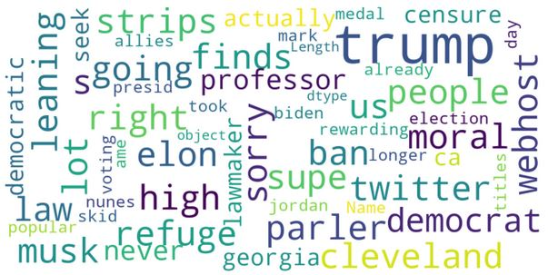
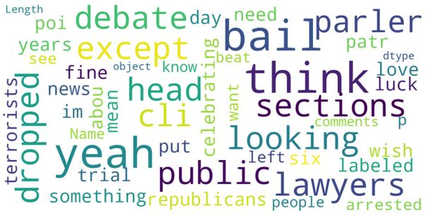
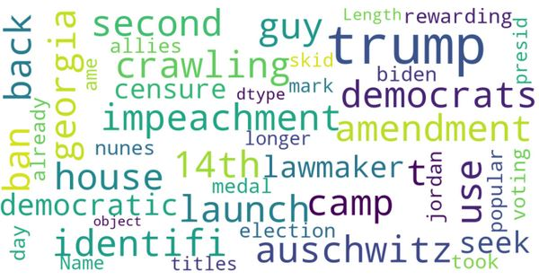
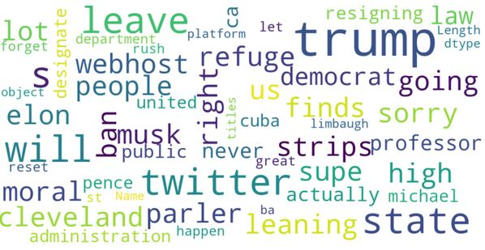
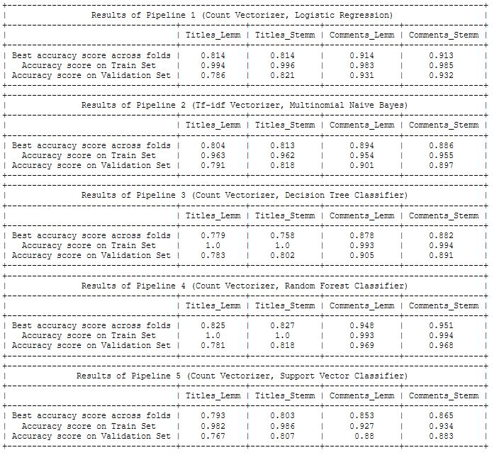
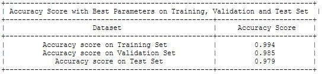
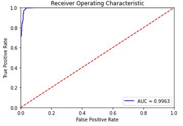

# Project 3 : Reddit API and Classification

## Problem Statement
This is a binary classification data science problem where I scrape data of two of my selected subreddits, `r/Conservative` and `r/democrats`, and  train classification algorithms on it to categorise a post correctly into one of the two.

## Introduction
Public opinion towards political parties have a role to play in elecion outcomes. Different political parties have different views of public policies, and these public policies affect the general populace, businesses or even individuals. Businesses could benefit from preparing for any policy changes when during election where political leaders may change. 

Reddit is a social media platform moderated by the community themselves and has a relatively large userbase, in large part due to anonymity of user (Squirell, 2018). Compared to other social media platforms, reddit is likely to have the least biased posts on political leaning, which is a relatively objective data to try and determine public sentiments. 

A classification model that can accurately classify posts between `r/Conservative` and `r/democrats` could form a good foundation for further development like performing sentiment analysis and possibly predicting future election outcomes.

## Executive Summary
The objective of this project is to build a classification model that can accurately classify a post into either `r/Conservative` or `r/democrats`. 

### Analysis and Findings
[<ins>Webscraping data using Reddit's API</ins>](code/01-webscraping-using-subreddit-apis.ipynb)

On first scrape of data, I note that the nature of the subreddit posts on `r/Conservative` and `r/democrats` are that each post most often have a title, comment threads and link to an article from a news site. There is rarely content in the body of the post itself. Due to this nature, I decided to work with just the titles and the comments as my data. 

[<ins>Data Cleaning and Exploration</ins>](code/02-data-cleaning-and-preprocessing.ipynb)
With the titles and comments, prior to modelling, I preprocessed it to expand contractions, remove punctuations and tokenizing. On top of that, I also created two separate files for each dataset (ie. titles and comments) where I did stemming on one, and lemmatized the other. This is to see which ones can work better in modelling later.

The target variable is also converted to a binary where `r/Conservative`s are labelled as 1 and `r/democrats` lebelled as 0. 

Prior to modelling, I did a quick view of the most frequent words used using a word cloud to visualise them. 

*Figure 1: Wordcloud of titles in both subreddits, `r/Conservative` and `r/democrats`*

Most frequent word in titles is **Trump**, which is no surprise. At the time this project was done, it was days before the transition for Biden as President of the United States, and Trump (the current President) and his supporters did not make it easy. There was a riot at the US Capitol, innocent bystanders were killed, some policemen who were truly loyal to Trump failed to uphold their duty during the violence. Several articles came up on these on various news channels. 

**Twitter** came up here because Trump's twitter acount was initally suspended for 6 hours but it has since been permanently suspended due to risk of further incitement of violence (in relation to the US Capital riots). (Twitter Inc. 2021)

**Elon Musk** came up here because several news channels reported that his net worth exceeded Jeff Bezos (Amazon CEO) to become the richest person in the world. 

*Figure 2: Wordcloud of comments in both subreddits, `r/Conservative` and `r/democrats`*

**bail, parler, lawyers** are related to the same issue. Parler is a social network platform known for embracing people who are banned by Twitter, YouTube and other platforms. Parler's site is supported by Amazon Web Services (AWS). Amazon decided to effectively terminate Parler's account as it is deemed to be directly contributing to violence by Trump supporters. Parler has since filed a federal lawsuit against Amazon for removing supporting of its website. (Hayes, 2021)

Let's look at the words that come up in the respective subreddits below :

*Figure 3: Wordcloud of titles in `r/democrats`*

In the democrats camp, we see **trump** being the most used, along with **impeachment**. The **14th amendment**, Section 3 which provided an alternative path for disqualification of a person from holding office, if they have engageed in "insurrection or rebellion" in the United States (which we saw in the US Capitol riots.(Wolfe, 2021)

This shows how democrats are discussion options to remove Trump from office for inciting a mob that stormed the Capital, days before Biden takes over the Presidency. 

*Figure 4: Wordcloud of titles in `r/Conservative`*

Over at the conservatives camp, **trump** is equally mentioned, along with **twitter**. Twitter had so much mentions probably because when Twitter banned Trump, the conservatives were livid and expressed their displeasure in this subreddit.  

[<ins>Model Selection and Evaluation</ins>](code/03-modeling-tuning-conclusion.ipynb)

In model selection, I first fit data into a few pipeline models, without changing the parameters. This will be the baseline model from which I will then score and select the best performing model to go forward with. 

To evaluate which one is the best performing model, there a few metrics considered below (Vidhya, 2020) : 

| Metric | Elaboration and Analysis |
| :-----: | :-------- | 
| Accuracy | provides fraction of predictions that the model got right (ie. number of correct predictions / total number of predictions). This metric may not work well on imbalanced classes like the data I collected, but since I have balanced the classes with `RandomOverSampling`, I can rely on the accuracy metric.  |
| Precision | provides the fraction of correctly identified positives out of all predicted positives. [TP / (TP + FP)]. This indicates how much we can trust the algorithm when it predicts a class. |
| Recall/Sensitivity | provides the fraction of correctly identified as positive out of all positives. [TP / (TP + FN)] . This shows how many of the true labels of the class is predicted correctly. |
| F1-score | a harmonic mean of precision and recall. While we want to maximise precision and recall, it is a trade-off. Since I have no bias towards any classes (ie. predicting a post to be from `r/Conservative` is as good/bad as predicting a post to be from `r/democrats`), the F1 score may not as important as accuracy, for this project. |

Once selected the best performing model, I will then use that model and tune its hyperparameters.

I run the four datasets abovementioned into 5 different classfication models in a pipeline with count vectorizer or tf-idf vectorizer. Results are as shown below in Figure 4:

*Figure 5: Accuracy scores for all 5 classification algorithms used*

From here, there are several observations:

1. Comments always have a better score than titles, so I willl use the comments data to train in the final model. This is expected since there is more data available in comments than titles (ie. there can be several hundreds of comments on a particular post)  

2. Generally, stemmed words have a better score than lemmatized words. This is likely because words used in both `r/Conservative` and `r/democrats` are already very distinct from each other, such that a harsher truncation by stemming makes the model more effective. 

3. Comparing scores on train set, the `RandomForestClassifier` and the `DecisionTreeClassifier` were the best performing model. However, when looking at the average `cross_val_score`, the `RandomForestClassifier` did better. 

Based on this analysis, I will move forward with the `RandomForestClassifier` algorithm.

With the `RandomForestClassifier` algorithm, I then use gridsearchcv to tune its parameters to try and make it work even better. Looking at the best parameters, we observe some interesting insights below.

| Hyperparameter | Hyperparameter Value |
| :-----: | :--------: | 
| cvec__stop_words | None |
| cvec__ngram_range | (1, 2) |

1. Surprisingly, not removing stop words improved the model. This suggests that stop words help in making sense of the data with respect to each subreddit. It is likely that stopwords help with the context in each of these subreddits.

2. ngram range is (1,2) which means both unigrams and bigrams (ie. single words or two words back-to-back) are considered together in training the model to help it perform better. 

Now using the best parameters, I run the model again with the following scores :

*Figure 6: Accuracy score for Random Forest Classifier algorithm, with best parameters*

The model did very well and is able to classify post correctly in the respective subreddits 97.9% of the time. 

*Figure 7: ROC-AUC curve for production model*

The ROC-AUC curve represents the degree or measure of separability between the subreddits. AUC score measure between 0 and 1 and a good score is one that is closest to 1, with one being the perfect model. With our well performing model, it is reasonable to expect an AUC score close to 1. 

### Conclusion 

Random Forest Classifier performed really well to classify a post between `r/Conservative` and `r/democrats`. This is expected as from the data exploration done earlier, we see pretty distinct words used in each of these subreddits. While we would expect similar topics to be discussed or similar mentions in both `r/Conservative` and  `r/democrats`, from our results, it appears that the content that is discussed in each subreddit goes in very different directions (ie. redditors use very distinct words for each subreddit).

**Further Development**

With this model, we can perform further sentiment analysis and from public sentiment, we could predict outcomes of future elections. Businesses would then be able to prepare for policy changes and if needed pivot the business in favour of any upcoming policy changes. 

## References

"Reddit is the best social media site because it gets community right" (Squirrell, 2018)
https://qz.com/1309562/reddit-is-the-best-social-media-site-because-it-gets-community-right/

"Permanent suspension of @realDonaldTrump" (Twitter Inc. 2021)
https://blog.twitter.com/en_us/topics/company/2020/suspension.html

"Amazon Rips Parler Lawsuit, Calling Companies "Unable or Unwilling" to Police Its Site" (Hayes, 2021)
https://deadline.com/2021/01/parler-sues-amazon-trying-to-kill-site-donald-trump-1234671259/

"Explainer: Impeachment or the 14th Amendment - Can Trump be barred from future office?" (Wolfe, 2021)
https://www.reuters.com/article/us-usa-trump-impeachment/explainer-impeachment-or-the-14th-amendment-can-trump-be-barred-from-future-office-idUSKBN29I356
